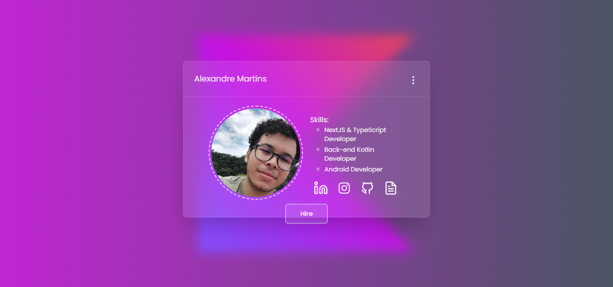

<h1 align="center">MyPage: Card Portfólio</h1>

> Status: Em desenvolvimento...

<p align="center">
  
</p>

<p align="center">Meu Card Portfólio pessoal.</p>

## Tecnologias

Este projeto utiliza as seguintes tecnologias:

- Next.js
- TypeScript
- Tailwind CSS & ShadcnUI

<!--
## Informações Úteis

- Projeto no ar [aqui]() -->

## Instalação e Uso

Clone o repositório e instale as dependências:

```bash
git clone https://github.com/gafanhotoalexandre/my-page.git
cd my-page
npm install
```
